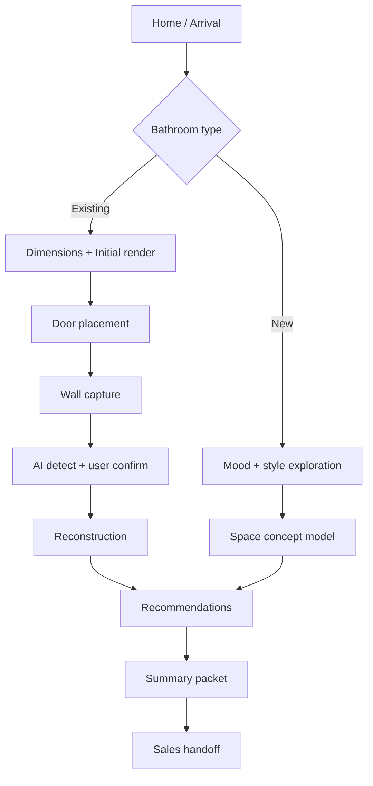

# UX Blueprint

## Screen flow

## Interaction principles

- Keep each screen under one decision.
- Use ambient visuals and no hard transitions.
- Provide always-visible progress state.
- Keep one primary action visible, one secondary action available.

## Failure handling

- Missing room photos: degrade to guided sketch mode while keeping tone supportive.
- Low-confidence detection: request second-angle shots with explicit reason.
- No upload support: provide manual measurement fallback.

## Accessibility baseline

- Contrast-aware contrast ratio and non-color-only cues.
- Keyboard-first navigation in all controls.
- Motion preference handling (reduce-motion fallback).

